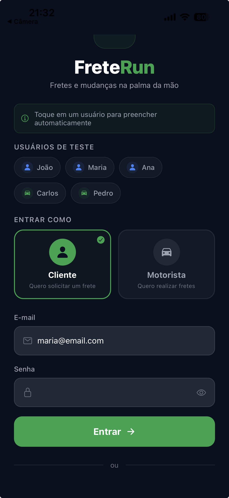
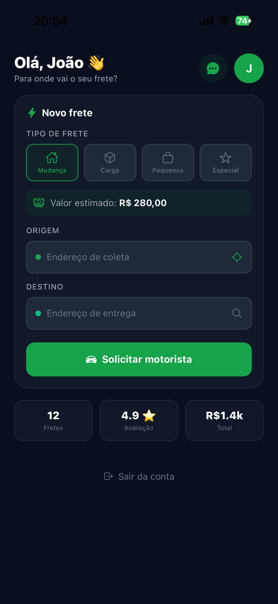

# 🚛 FreteRun

Aplicativo mobile desenvolvido em **React Native com Expo**, especialmente para iPhone, que conecta **clientes e motoristas** para realização de fretes e mudanças de forma digital, segura e eficiente.

---

<<<<<<< HEAD
## 📸 Telas do aplicativo

### Tela 1 — Tela de login


### Tela 2 — Dashboard do Cliente


### Tela 3 — Chat com Motorista


---

## ✨ Funcionalidades

### 👤 Login
- Seleção de perfil: **Cliente** ou **Motorista**
- Banco de dados local com 5 usuários
- Chips de atalho para preencher automaticamente
- Validação de e-mail, senha e perfil
- Mensagem de erro amigável

### 📦 Dashboard do Cliente
- Seleção do tipo de frete (Mudança, Carga, Pequenos, Especial)
- Cálculo de valor estimado por tipo de frete
- Campos de origem e destino
- Chat com o motorista
- Histórico de fretes

### 🚛 Tela — Acompanhar Frete
- Rastreamento em tempo real simulado (6 etapas)
- Barra de progresso por etapa
- Card do motorista com nome, veículo, placa e avaliação
- Mapa simulado
- Cancelar frete e avaliar motorista com estrelas

### 🚛 Dashboard do Motorista
- Toggle Online/Offline
- Resumo do dia (corridas, ganhos, avaliação, km)
- Detalhes completos de cada corrida
- Chat com o cliente
- Histórico de ganhos com meta do dia
- Abas: Fretes disponíveis / Ganhos do dia

---

## 👥 Usuários de teste

| Nome | E-mail | Perfil | Senha |
|---|---|---|---|
| João Silva | joao@email.com | Cliente | 123456 |
| Maria Oliveira | maria@email.com | Cliente | 123456 |
| Ana Costa | ana@email.com | Cliente | 123456 |
| Carlos Santos | carlos@email.com | Motorista | 123456 |
| Pedro Alves | pedro@email.com | Motorista | 123456 |
=======
## 📱 Sobre o projeto

O FreteRun utiliza geolocalização, rastreamento em tempo real e pagamento integrado para oferecer uma experiência completa tanto para quem precisa de um frete quanto para quem realiza o serviço.

---

## 🖥️ Telas

### Tela 1 — Login
- Seleção de perfil: **Cliente** ou **Motorista**
- Formulário de e-mail e senha
- Link para cadastro

"./images/WhatsApp Image 2026-05-28 at 20.02.26.jpeg"
"./images/WhatsApp Image 2026-05-28 at 20.03.05.jpeg"

### Tela 2A — Dashboard do Cliente
- Seleção do tipo de frete (Mudança, Carga, Pequenos, Especial)
- Campos de origem e destino
- Botão para solicitar motorista
- Estatísticas rápidas
- Histórico de fretes

### Tela 2B — Dashboard do Motorista
- Toggle Online/Offline
- Resumo do dia (corridas, ganhos, avaliação, km)
- Lista de fretes disponíveis próximos
- Botões Aceitar e Recusar corridas
>>>>>>> ee0af424613f126b2ceb131531ed26ab818bcf46

---

## 🚀 Como executar

<<<<<<< HEAD
### Via Expo Snack
1. Acesse https://snack.expo.dev
2. Cole o conteúdo do `App.js`
3. Escaneie o QR Code com o **Expo Go** no iPhone
=======
### Via Expo Snack (mais fácil)
1. Acesse https://snack.expo.dev
2. Cole o conteúdo do `App.js`
3. Escaneie o QR Code com o Expo Go no iPhone
>>>>>>> ee0af424613f126b2ceb131531ed26ab818bcf46

### Via VS Code
```bash
npm install
npx expo start --tunnel --clear
```

---

<<<<<<< HEAD
## 🗂️ Estrutura do projeto

```
freterun/
├── App.js                          # Código principal
├── App.tsx
├── app.json
├── package.json
├── tsconfig.json
├── eslint.config.js
├── README.md
├── .gitignore
├── assets/
│   └── images/
│       ├── tela-cliente-dashboard.png
│       └── tela-chat.png
├── app/
├── components/
├── constants/
├── hooks/
├── pages/
├── routes/
└── scripts/
=======
## 📋 Pré-requisitos

- Node.js (versão LTS)
- npm
- Expo Go instalado no iPhone (App Store)
- VS Code

---

## 🗂️ Estrutura do projeto

```
FreteRun/
├── App.js                          # Entrada e navegação
├── app.json                        # Config do Expo
├── package.json
├── babel.config.js
└── src/
    └── screens/
        ├── LoginScreen.js          # Tela de login
        ├── ClienteDashboard.js     # Dashboard do cliente
        └── MotoristaDashboard.js   # Dashboard do motorista
>>>>>>> ee0af424613f126b2ceb131531ed26ab818bcf46
```

---

## 🎨 Design

- Tema escuro com fundo `#0A0F1E`
- Cor primária verde `#16A34A`
- Ícones via `@expo/vector-icons` (Ionicons)
<<<<<<< HEAD
- Navegação via `useState`
=======
- Navegação via `useState` sem dependências nativas
>>>>>>> ee0af424613f126b2ceb131531ed26ab818bcf46

---

## 👨‍💻 Tecnologias

- React Native
- Expo SDK 54
<<<<<<< HEAD
- TypeScript / JavaScript
- @expo/vector-icons
=======
- JavaScript
- @expo/vector-icons
>>>>>>> ee0af424613f126b2ceb131531ed26ab818bcf46
