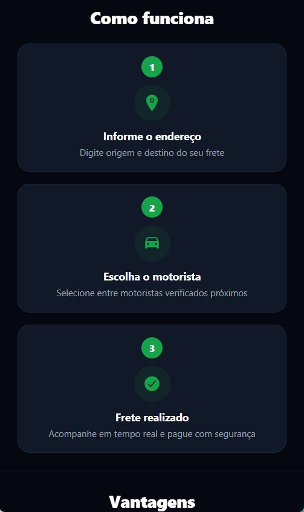
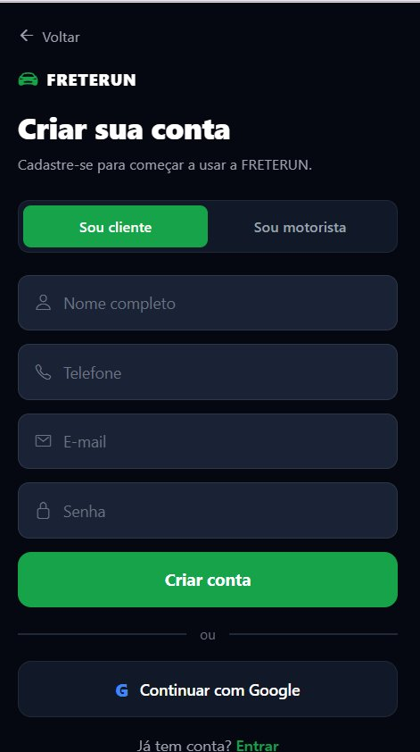
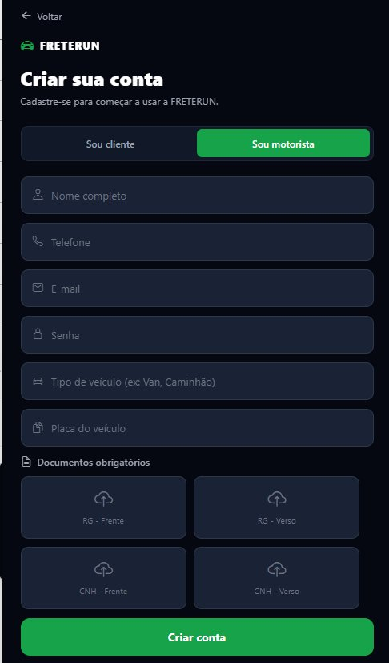
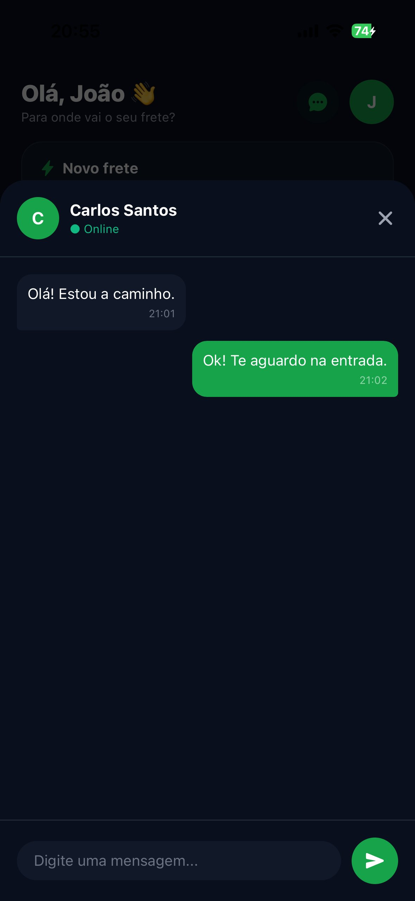

<<<<<<< HEAD
# 🚛 FreteRun - Mobile App
=======
# 🚛 FreteRun
>>>>>>> ab32ceb1a512c9bef4a98ec355acdc17f63ada1c

Aplicativo mobile desenvolvido em **React Native com Expo**, especialmente para iPhone, que conecta **clientes e motoristas** para realização de fretes e mudanças de forma digital, segura e eficiente.

---

<<<<<<< HEAD
## 👥 Integrantes da Equipe

| Nome |
|---|
| Victor Daniel |
| Gabriel Freitas |
| João Davi |
| Luiz Gustavo |

---

## 📸 Telas do aplicativo

### Landing Page


### Como Funciona


### Vantagens


### Cadastro — Cliente


### Cadastro — Motorista


### Dashboard do Cliente


### Chat com Motorista


---

## 📋 Descrição

O **FreteRun** é um aplicativo mobile no estilo Uber, voltado para o segmento de fretes e mudanças urbanas. Conecta clientes que precisam transportar cargas a motoristas verificados disponíveis na região, oferecendo rastreamento em tempo real, chat integrado e sistema de avaliação.

---

## ✨ Funcionalidades Implementadas

### 🔐 Autenticação e Persistência
- **AsyncStorage**: Persistência de dados local para usuários e fretes.
- **Validações Robustas**: Verificação de e-mail, telefone (máscara), senha forte e campos obrigatórios.
- **Sistema de Login**: Suporte a múltiplos perfis (cliente e motorista) com usuários de teste pré-carregados.

### 🏠 Landing Page
- Design moderno e responsivo inspirado no Lovable.
- Navegação fluida para fluxos de cliente e motorista.

### 📦 Gestão de Fretes
- **Dashboard Cliente**: Solicitação de fretes com estimativa de preço em tempo real.
- **Rastreamento**: Fluxo de acompanhamento de frete com 6 etapas animadas.
- **Dashboard Motorista**: Lista de fretes disponíveis e resumo de ganhos diários.

### 💬 Comunicação e Feedback
- **Chat Modal**: Interface de chat integrada para comunicação entre cliente e motorista.
- **Sistema de Avaliação**: Modal de feedback com sistema de estrelas.
- **Toasts Customizados**: Feedback visual para ações do usuário (sucesso, erro, avisos).

---

## 👥 Usuários de teste

| Nome | E-mail | Perfil | Senha |
|---|---|---|---|
| João Silva | joao@email.com | Cliente | 123456 |
| Maria Oliveira | maria@email.com | Cliente | 123456 |
| Ana Costa | ana@email.com | Cliente | 123456 |
| Carlos Santos | carlos@email.com | Motorista | 123456 |
| Pedro Alves | pedro@email.com | Motorista | 123456 |
=======
## 📱 Sobre o projeto

O FreteRun utiliza geolocalização, rastreamento em tempo real e pagamento integrado para oferecer uma experiência completa tanto para quem precisa de um frete quanto para quem realiza o serviço.

---

## 🖥️ Telas

### Tela 1 — Login
- Seleção de perfil: **Cliente** ou **Motorista**
- Formulário de e-mail e senha
- Link para cadastro

"./images/WhatsApp Image 2026-05-28 at 20.02.26.jpeg"
"./images/WhatsApp Image 2026-05-28 at 20.03.05.jpeg"

### Tela 2A — Dashboard do Cliente
- Seleção do tipo de frete (Mudança, Carga, Pequenos, Especial)
- Campos de origem e destino
- Botão para solicitar motorista
- Estatísticas rápidas
- Histórico de fretes

### Tela 2B — Dashboard do Motorista
- Toggle Online/Offline
- Resumo do dia (corridas, ganhos, avaliação, km)
- Lista de fretes disponíveis próximos
- Botões Aceitar e Recusar corridas
>>>>>>> ab32ceb1a512c9bef4a98ec355acdc17f63ada1c

---

## 🚀 Como executar

<<<<<<< HEAD
### Dependências necessárias
- Node.js (versão LTS)
- Expo Go instalado no smartphone

### Passos

```bash
# 1. Instalar dependências
npm install

# 2. Iniciar o projeto
npx expo start --tunnel --clear
```

Escaneie o QR Code com o **Expo Go** no smartphone.
=======
### Via Expo Snack (mais fácil)
1. Acesse https://snack.expo.dev
2. Cole o conteúdo do `App.js`
3. Escaneie o QR Code com o Expo Go no iPhone

### Via VS Code
```bash
npm install
npx expo start --tunnel --clear
```

---

## 📋 Pré-requisitos

- Node.js (versão LTS)
- npm
- Expo Go instalado no iPhone (App Store)
- VS Code
>>>>>>> ab32ceb1a512c9bef4a98ec355acdc17f63ada1c

---

## 🗂️ Estrutura do projeto

```
FreteRun/
<<<<<<< HEAD
├── App.js                 ← Componente principal e navegação
├── index.js               ← Entry point
├── app.json               ← Configuração do Expo
├── package.json           ← Dependências
├── src/
│   ├── components/        ← Componentes reutilizáveis (Chat, Avaliação, Toast)
│   ├── services/          ← Lógica de dados (Auth, Fretes com AsyncStorage)
│   └── utils/             ← Constantes, Validações e Estilos globais
├── screenshots/           ← Prints das telas
└── assets/                ← Imagens e recursos estáticos
=======
├── App.js                          # Entrada e navegação
├── app.json                        # Config do Expo
├── package.json
├── babel.config.js
└── src/
    └── screens/
        ├── LoginScreen.js          # Tela de login
        ├── ClienteDashboard.js     # Dashboard do cliente
        └── MotoristaDashboard.js   # Dashboard do motorista
>>>>>>> ab32ceb1a512c9bef4a98ec355acdc17f63ada1c
```

---

<<<<<<< HEAD
## 👨‍💻 Tecnologias

- **React Native** (v0.81)
- **Expo SDK 54**
- **AsyncStorage** — Persistência local de dados
- **@expo/vector-icons** — Ícones (Ionicons)
- **JavaScript**
- **Expo Notifications** — Notificações nativas

---

## 🎨 Design

- **Tema**: Dark Mode
- **Cor Primária**: Verde `#16A34A`
- **Background**: `#0A0F1E`
- **Inspiração**: Lovable.dev
=======
## 🎨 Design

- Tema escuro com fundo `#0A0F1E`
- Cor primária verde `#16A34A`
- Ícones via `@expo/vector-icons` (Ionicons)
- Navegação via `useState` sem dependências nativas

---

## 👨‍💻 Tecnologias

- React Native
- Expo SDK 54
- JavaScript
- @expo/vector-icons
>>>>>>> ab32ceb1a512c9bef4a98ec355acdc17f63ada1c
