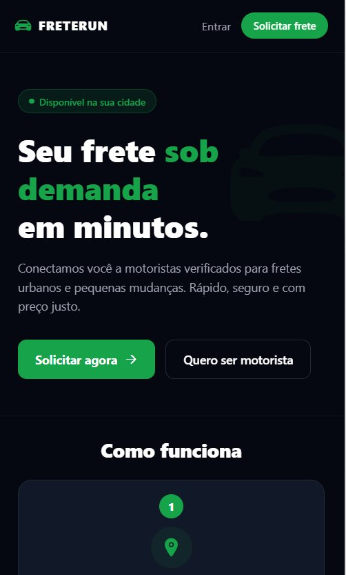
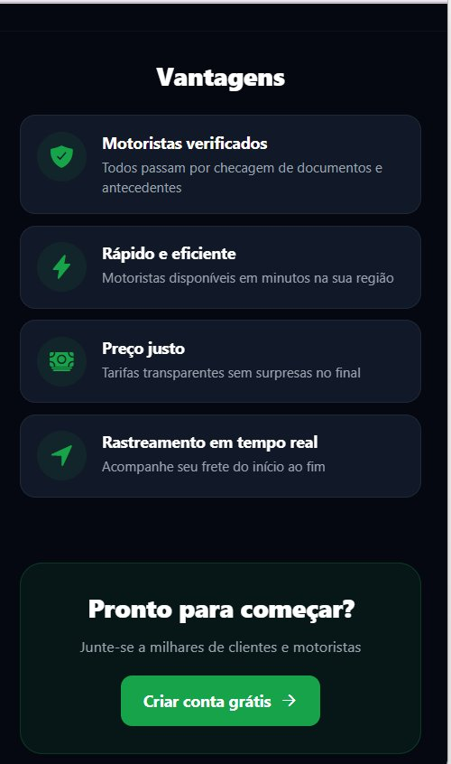

# 🚛 FreteRun

Aplicativo mobile desenvolvido em **React Native com Expo**, especialmente para iPhone, que conecta **clientes e motoristas** para realização de fretes e mudanças de forma digital, segura e eficiente.

---

## 📸 Telas do aplicativo

### Landing Page


### Como Funciona


### Vantagens


### Cadastro — Cliente


### Cadastro — Motorista


### Dashboard do Cliente


### Chat com Motorista


---

## ✨ Funcionalidades

### 🏠 Landing Page
- Navbar com logo e botão Entrar
- Hero "Seu frete sob demanda em minutos"
- Seções Como funciona e Vantagens
- Botões Solicitar agora e Quero ser motorista

### 📝 Cadastro
- Toggle Sou cliente / Sou motorista
- Campos: Nome, Telefone, E-mail, Senha
- Motorista: Tipo de veículo, Placa, Documentos (RG e CNH)
- Continuar com Google

### 👤 Login
- Seleção de perfil Cliente/Motorista
- 5 usuários de teste com chips de atalho
- Validação de e-mail e senha

### 📦 Dashboard do Cliente
- Tipo de frete com valor estimado
- Campos de origem e destino
- Solicitar motorista
- Chat com motorista

### 🚛 Acompanhar Frete
- Rastreamento em tempo real simulado (6 etapas)
- Card do motorista com nome, veículo e placa
- Cancelar frete e avaliar motorista com estrelas

### 🚛 Dashboard do Motorista
- Toggle Online/Offline
- Resumo do dia (corridas, ganhos, avaliação, km)
- Abas: Fretes disponíveis / Ganhos do dia
- Chat com cliente

---

## 👥 Usuários de teste

| Nome | E-mail | Perfil | Senha |
|---|---|---|---|
| João Silva | joao@email.com | Cliente | 123456 |
| Maria Oliveira | maria@email.com | Cliente | 123456 |
| Ana Costa | ana@email.com | Cliente | 123456 |
| Carlos Santos | carlos@email.com | Motorista | 123456 |
| Pedro Alves | pedro@email.com | Motorista | 123456 |

---

## 🚀 Como executar

### ✅ Via Expo Snack (recomendado — sem instalação)

1. Acesse 👉 **https://snack.expo.dev**
2. Apague o conteúdo do `App.js` no editor
3. Cole o conteúdo do arquivo `App.js` deste repositório
4. Clique em **Save**
5. No canto direito clique em **"My Device"**
6. Escaneie o QR Code com o **Expo Go** no iPhone
7. Ou clique em **"Web"** para ver direto no navegador

### Via VS Code
```bash
npm install
npx expo start --tunnel --clear
```
Escaneie o QR Code com o **Expo Go** no iPhone.

---

## 🗂️ Estrutura do projeto

```
FreteRun/
├── App.js                 ← Código principal
├── index.js               ← Entry point
├── app.json
├── package.json
├── babel.config.js
├── screenshots/           ← Prints das telas
│   ├── tela-landing-hero.png
│   ├── tela-como-funciona.png
│   ├── tela-vantagens.png
│   ├── tela-cadastro-cliente.png
│   ├── tela-cadastro-motorista-1.png
│   ├── tela-cadastro-motorista-2.png
│   ├── tela-cliente-dashboard.png
│   └── tela-chat.png
└── assets/
    └── images/
```

---

## 🎨 Design

- Tema escuro com fundo `#0A0F1E`
- Cor primária verde `#16A34A`
- Ícones via `@expo/vector-icons` (Ionicons)

---

## 👨‍💻 Tecnologias

- React Native
- Expo SDK 54
- JavaScript
- @expo/vector-icons
